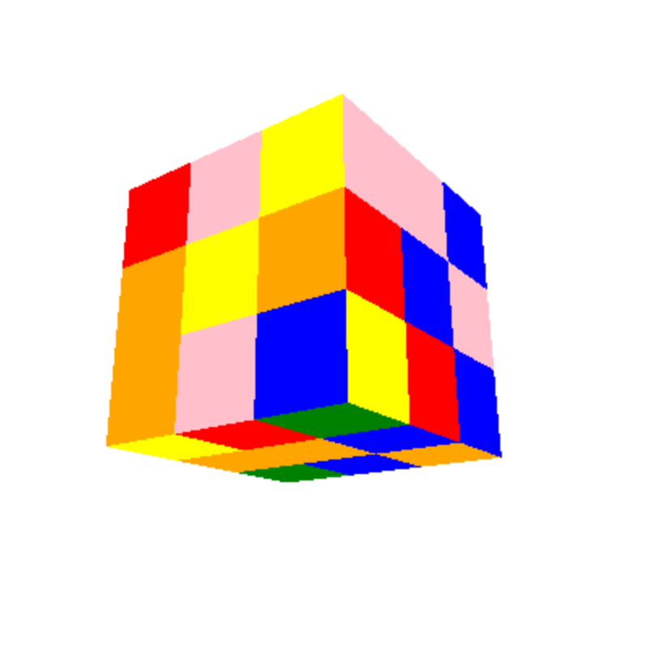
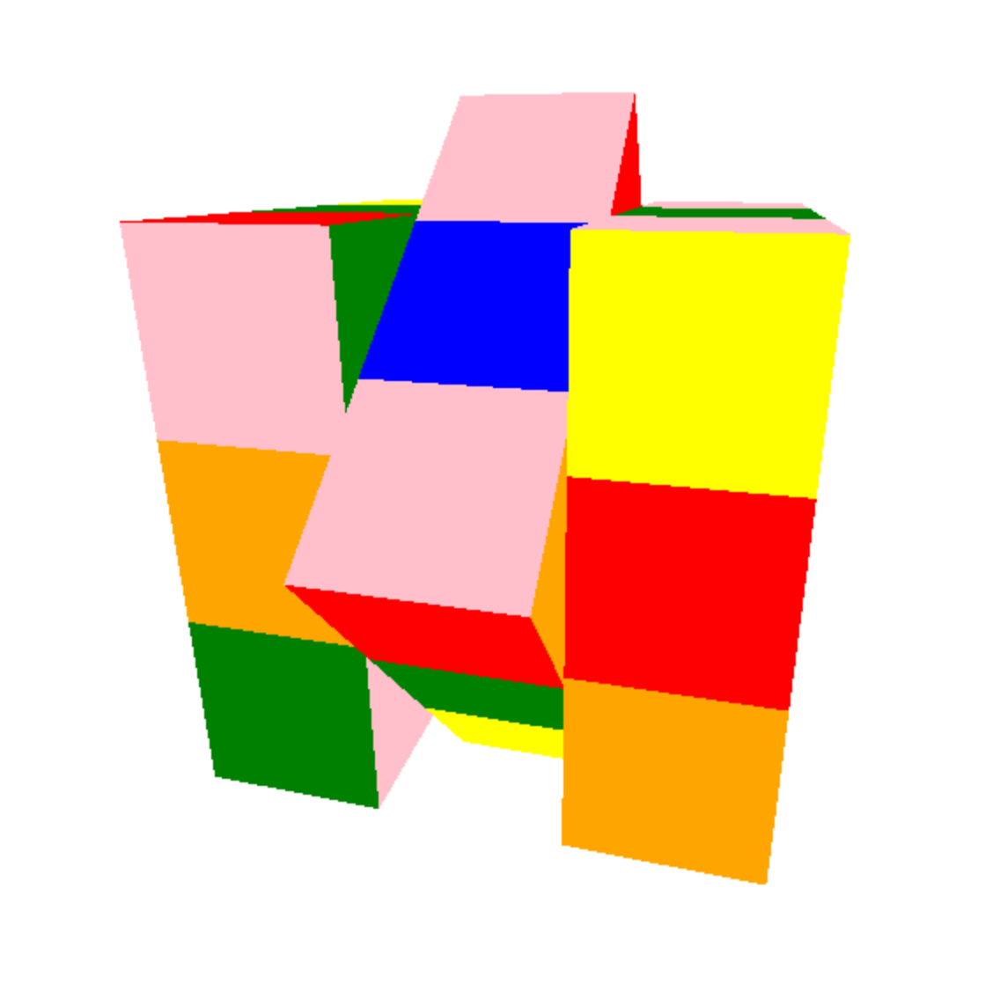
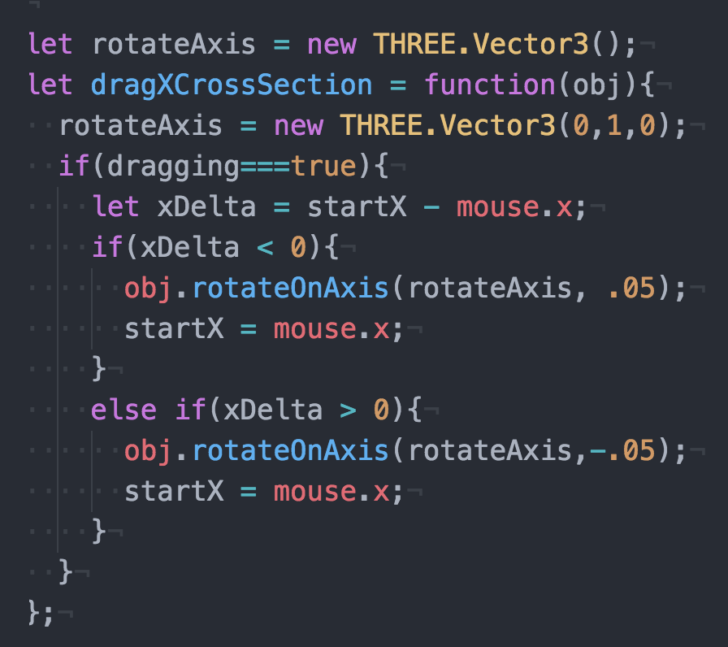
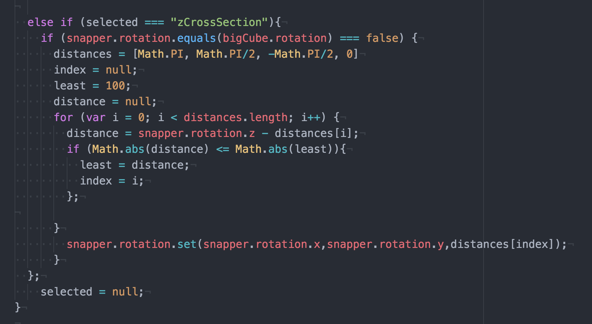
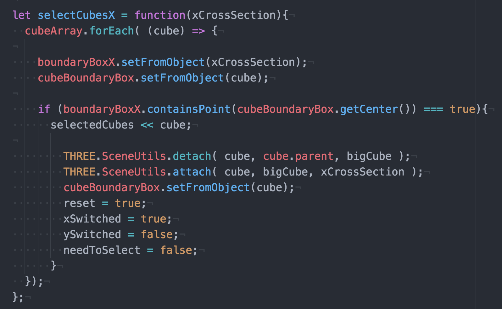

# Rubiks-Cube

[3D Rubik’s Cube](http://daniellebuterakeefe.com/Rubiks-Cube/index.html) implemented using [Three.Js](https://threejs.org/).

Camera rotates to show cube from different angles:

Each cross-section rotates when you drag the mouse:

Cross-sections "snap" back into place:

Smaller cubes "detach" and "reattach" to different cross sections:

